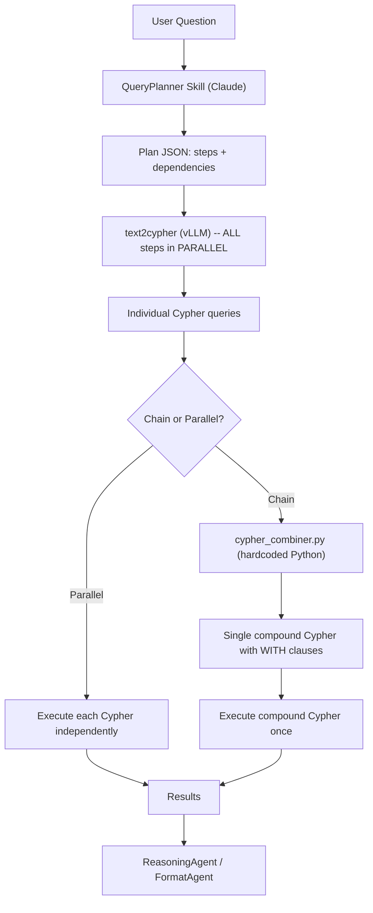

# Chain + Parallel Query Planner Skill (v2)

## Problem

The PankBaseAgent currently generates natural-language sub-queries that each get translated to Cypher by the vLLM text2cypher model, then executed independently against Neo4j. For multi-hop questions like "Which GO terms are associated with genes that have OCR active in Beta cells?", the 3 independent queries return disconnected result sets with no joins.

## Solution: Two-Phase Approach



**Phase 1 -- Planning (Claude):** Given the question + graph schema, output a JSON plan with natural-language steps. Each step is a simple one-hop query description (same format text2cypher already handles). Steps can be `"parallel"` or `"chain"` (with `depends_on` links).

**Phase 2 -- Execution (Python):**
1. Send ALL steps to text2cypher in parallel (they are all simple one-hop NL queries)
2. Collect the Cypher outputs
3. If `plan_type == "chain"`: run `cypher_combiner.py` to merge the Cypher queries into a compound query using `WITH` carry-forward, then execute once
4. If `plan_type == "parallel"`: execute each Cypher independently (current behavior)

## Compound Cypher Combiner Logic

The combiner takes ordered Cypher queries from a chain and merges them:

**Input** (3 individual Cyphers from text2cypher):
```
Step 1: MATCH (o:OCR)-[r1:OCR_activity]->(ct:cell_type) WHERE ct.name = "Beta Cell" WITH collect(DISTINCT o)... RETURN nodes, edges;
Step 2: MATCH (o:OCR)-[r2:OCR_locate_in]->(g:gene) WITH collect(DISTINCT o)... RETURN nodes, edges;
Step 3: MATCH (g:gene)-[r3:function_annotation]->(go:gene_ontology) WITH collect(DISTINCT g)... RETURN nodes, edges;
```

**Combiner extracts** the MATCH+WHERE clause from each, strips the WITH/RETURN tail, and rebuilds:
```cypher
MATCH (o:OCR)-[r1:OCR_activity]->(ct:cell_type) WHERE ct.name = "Beta Cell"
WITH o, ct, r1
MATCH (o)-[r2:OCR_locate_in]->(g:gene)
WITH o, ct, r1, g, r2
MATCH (g)-[r3:function_annotation]->(go:gene_ontology)
WITH collect(DISTINCT o)+collect(DISTINCT ct)+collect(DISTINCT g)+collect(DISTINCT go) AS nodes,
     collect(DISTINCT r1)+collect(DISTINCT r2)+collect(DISTINCT r3) AS edges
RETURN nodes, edges;
```

The key: the `WITH` between steps carries forward the **join variable** (the shared node variable between adjacent steps, e.g., `o` connects step 1 and 2, `g` connects step 2 and 3).

## Files to Create

### 1. [`skills/query-planner/scripts/prompts.py`](skills/query-planner/scripts/prompts.py)

Claude system prompt that:
- Receives the full graph schema (all 11 edge types with directions)
- Outputs a JSON plan with `plan_type` ("parallel" or "chain") and `steps`
- Each step has: `id`, `natural_language` (the query for text2cypher), `join_var` (the shared variable name with the next step), `depends_on` (step id, or null for parallel)
- Includes hardcoded few-shot examples for each question category (A-E)
- Includes rules: when to chain vs parallel, how to name join variables consistently

### 2. [`skills/query-planner/scripts/cypher_combiner.py`](skills/query-planner/scripts/cypher_combiner.py)

Pure Python, no LLM calls. Logic:
- Parse each Cypher to extract: MATCH clause, WHERE clause, node variables, edge variables
- For chain steps: strip `WITH collect(...)... RETURN...` tail from each
- Insert `WITH <join_vars>` between consecutive MATCH clauses
- Build final `WITH collect(DISTINCT ...)` that collects ALL node and edge variables
- Run existing `auto_fix_cypher` and `validate_cypher` on the result
- Add LIMIT safety

### 3. [`skills/query-planner/scripts/query_planner.py`](skills/query-planner/scripts/query_planner.py)

Main entry point with three functions:
- `plan_query(question: str) -> dict` -- calls Claude to generate the plan JSON
- `translate_plan(plan: dict) -> list[str]` -- sends all NL steps to text2cypher in parallel (reuses existing `_get_text2cypher_agent()` and thread pool), returns list of Cypher strings
- `combine_chain(cyphers: list[str], plan: dict) -> str` -- calls `cypher_combiner` for chain plans
- `execute_cypher(cypher: str) -> dict` -- sends to Neo4j API (reuses existing HTTP call logic from [`PankBaseAgent/utils.py`](PankBaseAgent/utils.py) lines 278-350)
- `run_query_planner_pipeline(question: str) -> list[dict]` -- end-to-end: plan + translate + combine/execute

### 4. [`skills/query-planner/SKILL.md`](skills/query-planner/SKILL.md) and `__init__.py`

## Files to Modify

### 5. [`PankBaseAgent/ai_assistant.py`](PankBaseAgent/ai_assistant.py)

Replace `chat_one_round_pankbase` internals. Instead of:
- Claude planning prompt -> NL sub-queries -> text2cypher per query -> Neo4j per query

It becomes:
- Import `run_query_planner_pipeline` from the skill
- Call it with the question
- Return results in same format `(messages, response, planning_data)`

The existing PankBaseAgent prompt ([`PankBaseAgent/prompts/general_prompt.txt`](PankBaseAgent/prompts/general_prompt.txt)) is no longer used -- planning moves to the skill's Claude prompt.

### 6. [`claude.py`](claude.py)

Add import for `run_query_planner_pipeline` and expose in `__all__`.

### 7. [`utils.py`](utils.py)

The `pankbase_chat_one_round` wrapper (line 429) may need minor updates to handle the new return format from the updated PankBaseAgent.

## Plan JSON Format

```json
{
  "plan_type": "chain",
  "reasoning": "Need 3 hops: OCR->CellType, OCR->Gene, Gene->GO. Chain on OCR and Gene.",
  "steps": [
    {
      "id": 1,
      "natural_language": "Get OCRs that have OCR_activity in Beta Cell",
      "join_var": "o",
      "depends_on": null
    },
    {
      "id": 2,
      "natural_language": "Get genes that have OCR_locate_in relationships with OCRs",
      "join_var": "g",
      "depends_on": 1
    },
    {
      "id": 3,
      "natural_language": "Get gene ontology terms that have function_annotation relationships with genes",
      "join_var": null,
      "depends_on": 2
    }
  ]
}
```

For parallel plans, all `depends_on` are null and each Cypher executes independently (current behavior).

## What Stays the Same

- **text2cypher vLLM model** -- unchanged, still generates one Cypher per NL query
- **Neo4j API endpoint** -- unchanged
- **cypher_validator + auto_fix_cypher** -- reused on the combined Cypher
- **ReasoningAgent / FormatAgent** -- unchanged, receives results as before
- **main.py orchestration** -- unchanged, still calls PankBaseAgent via `pankbase_chat_one_round`
