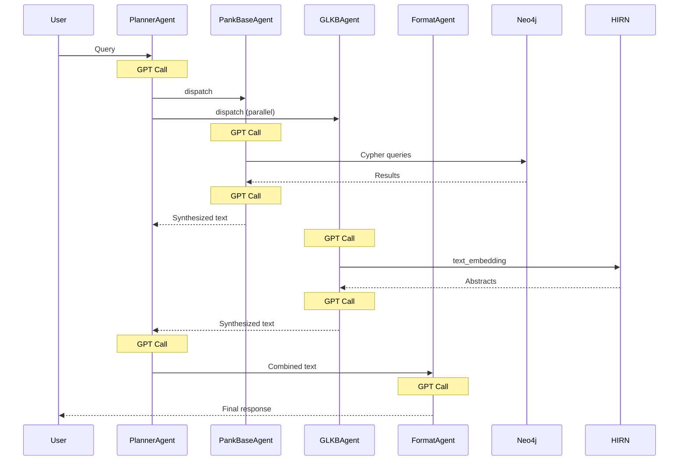
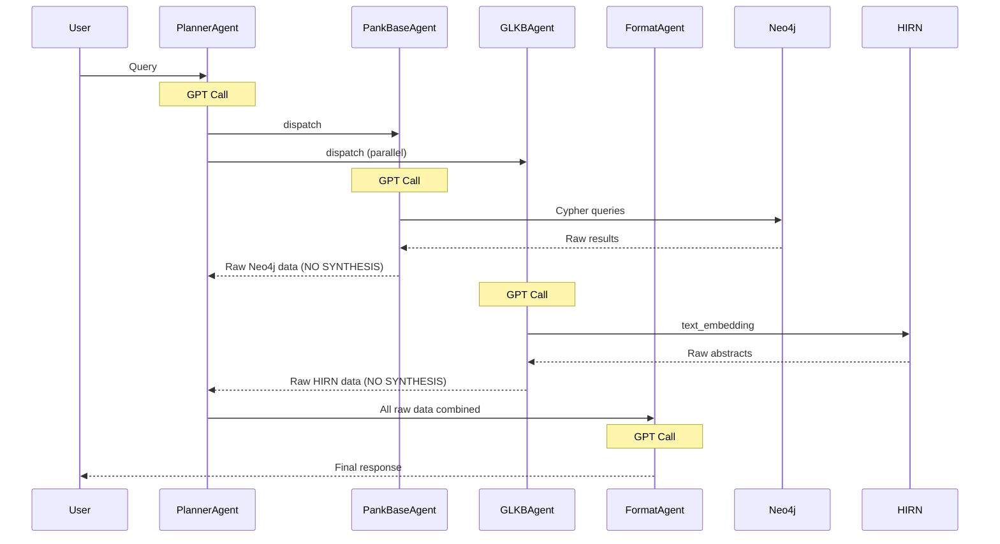

# Streamlined GPT-4o Pipeline

## Current Architecture: 7 GPT-4o Calls



**Problem:** Calls #3, #5, and #6 are redundant - they synthesize data that FormatAgent will re-synthesize anyway.---

## Proposed Architecture: 3 GPT-4o Calls



**Result:** 7 calls reduced to 4 calls (or 3 if only one sub-agent is used)---

## What Changes

### Calls KEPT (essential):

| Call | Purpose | Why Essential ||------|---------|---------------|| #1 Planner routing | Decide which agents to call | Need to route query || #2 PankBase planning | Decompose into Cypher queries | Need query planning || #3 GLKB planning | Create embedding query | Need query planning || #4 FormatAgent | Final synthesis + formatting | User-facing quality |

### Calls ELIMINATED (redundant):

| Call | What It Did | Why Redundant ||------|-------------|---------------|| PankBase synthesis | Summarize Neo4j results | FormatAgent does this better || GLKB synthesis | Summarize HIRN results | FormatAgent does this better || Planner synthesis | Combine both summaries | FormatAgent does this better |---

## Implementation Details

### Change 1: PankBaseAgent Returns Raw Data

**File:** [PankBaseAgent/ai_assistant.py](PankBaseAgent/ai_assistant.py)Current behavior (lines 52-86):

```python
while True:
    messages, response = chat_and_get_formatted(messages)  # GPT call
    if (response['to'] == 'user'):
        return (messages, response['text'], planning_data)  # Returns synthesized
    
    functions_result = run_functions(response['functions'])  # Neo4j results
    messages.append(...)  # Feed back to GPT for ANOTHER call (synthesis)
```

New behavior:

```python
while True:
    messages, response = chat_and_get_formatted(messages)  # GPT call (planning only)
    if (response['to'] == 'user'):
        return (messages, response['text'], planning_data)
    
    functions_result = run_functions(response['functions'])  # Neo4j results
    
    # NEW: Return raw results immediately - no second GPT call
    raw_response = {
        'planning': response.get('draft', ''),
        'queries_executed': response.get('functions', []),
        'raw_results': functions_result
    }
    return (messages, json.dumps(raw_response), planning_data)
```

---

### Change 2: GLKBAgent Returns Raw Data

**File:** [GLKBAgent/ai_assistant.py](GLKBAgent/ai_assistant.py)Same pattern - return raw HIRN abstracts instead of synthesizing:

```python
while True:
    messages, response = chat_and_get_formatted(messages)  # GPT call (planning only)
    if (response['to'] == 'user'):
        return (messages, response['text'])
    
    functions_result = run_functions(response['functions'])  # HIRN results
    
    # NEW: Return raw results immediately
    raw_response = {
        'query_used': response.get('functions', []),
        'raw_abstracts': functions_result
    }
    return (messages, json.dumps(raw_response))
```

---

### Change 3: main.py Passes Raw Data to FormatAgent

**File:** [main.py](main.py)Current behavior (lines 69-92):

```python
if (response['to'] == 'user'):
    # response['text'] is already synthesized by Planner
    format_input = f"""..."""
    format_result = format_agent(format_input)
```

New behavior - collect raw data from sub-agents and pass directly:

```python
if (response['to'] == 'user'):
    # Collect all raw data
    format_input = f"""Human Query: {original_question}

=== RAW DATA FROM PANKBASE ===
Cypher Queries Executed: {json.dumps(cypher_queries)}
Neo4j Results: {json.dumps(neo4j_results, indent=2)}

=== RAW DATA FROM GLKB ===
HIRN Abstracts: {json.dumps(glkb_raw_results, indent=2)}

Instructions: Synthesize ALL the above raw data into a structured response."""
    
    format_result = format_agent(format_input)
    return (messages, format_result)
```

---

### Change 4: Update FormatAgent Prompt

**File:** [prompts/format_prompt.txt](prompts/format_prompt.txt)Add section to handle raw data:

```javascript
## Input Format

You will receive:
- Human Query
- RAW Neo4j Results (JSON with actual database records)
- RAW HIRN Abstracts (JSON with PubMed data)

Your job is to:
1. Extract ALL relevant data from Neo4j results (IDs, coordinates, GO terms, etc.)
2. Extract PubMed IDs and key findings from HIRN abstracts
3. Synthesize into the structured format with proper citations
```

---

## Performance Comparison

| Scenario | Before | After | Speedup ||----------|--------|-------|---------|| PankBase only | 5 calls | 3 calls | 40% faster || GLKB only | 5 calls | 3 calls | 40% faster || Both agents | 7 calls | 4 calls | 43% faster |**Time estimate:**

- Before: 7 calls × 3s = ~21 seconds
- After: 4 calls × 3s = ~12 seconds
- **Savings: ~9 seconds per query**

---

## Summary of File Changes

| File | What Changes ||------|--------------|| `PankBaseAgent/ai_assistant.py` | Return raw Neo4j results after query execution || `GLKBAgent/ai_assistant.py` | Return raw HIRN results after query execution || `main.py` | Pass raw data directly to FormatAgent |